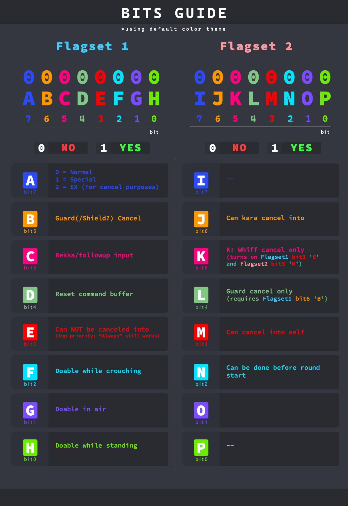

# MBAA Syntax

A comprehensive VS Code extension for **Melty Blood Actress Again Current Code** modding and data editing.

## Features

### 🎯 Command File Support (`*_c.txt`)
- Full syntax highlighting for MBAA command table files
- Color-coded command IDs, motions, and parameters  
- Per-bit binary flag visualization with individual colors
- Support for complex inputs: `236A`, `6+C`, `A+B+C+D`, `41236C`, etc.

### 📐 Vector File Support 
- `vector.txt`, `VectorList.txt`, `VectorSample.txt`
- Complete syntax highlighting for vector definitions
- **Individual bit coloring** for binary flags (e.g., `00043210` shows each bit in different colors)
- Support for vector coordinates, timing, and properties

### 🔊 SeList File Support (`*_SeList.txt`)
- Syntax highlighting for voice/sound mapping files
- Color-coded IDs, filenames, and Japanese descriptions
- Easy identification of voice file references

### 🎨 Built-in Color Themes
- **MBAA Poster (Dim Zeros)** - Subdued colors for zero bits
- **MBAA Poster (White Zeros)** - High contrast theme

## Binary Flag Visualization

Binary flags like `00043210` are color-coded bit by bit:
- **000** (first 3 zeros): Gray
- **4** (bit 4): Green  
- **3** (bit 3): Yellow
- **2** (bit 2): Pink
- **1** (bit 1): Cyan
- **0** (bit 0): Red



## Installation

1. Download the latest `.vsix` file from [Releases](../../releases)
2. In VS Code: `Ctrl+Shift+P` → "Extensions: Install from VSIX"
3. Select the downloaded `.vsix` file

## Usage

The extension automatically activates when you open supported files. Check the status bar for language mode confirmation.

### Manual Association (if needed):
```json
"files.associations": { 
  "*_c.txt": "mbaa-cmd",
  "*_SeList.txt": "mbaa-selist",
  "vector*.txt": "mbaa-vector"
}
